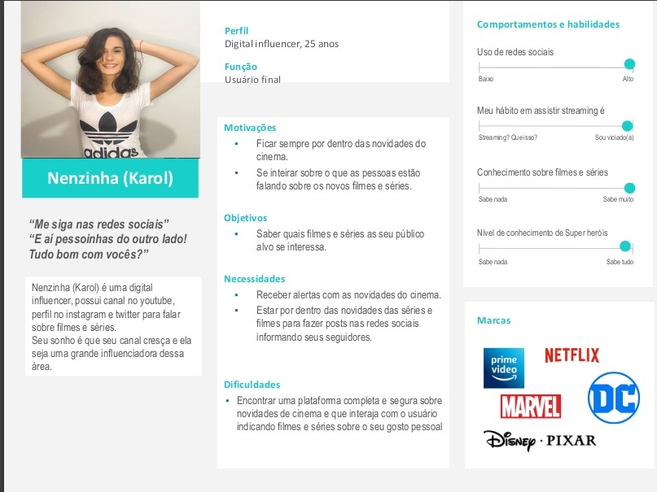
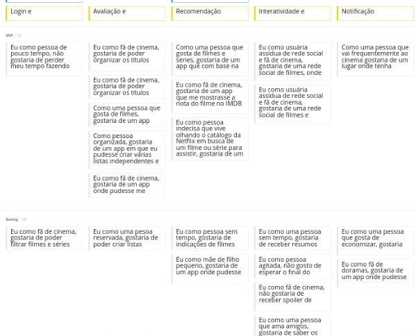
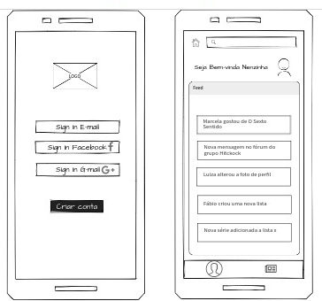
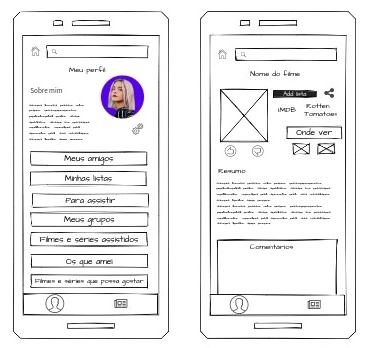
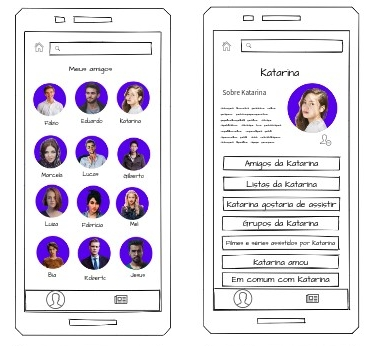
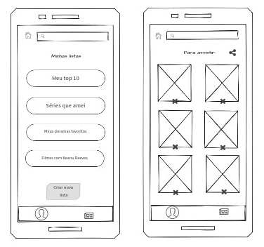
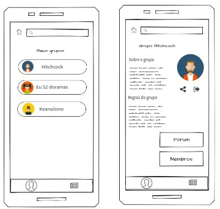
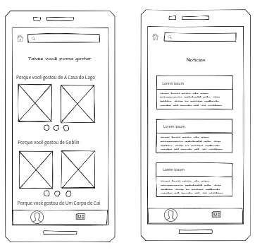

<h1 align="center"> Portfólio do Bootcamp de UX Designer IGTI 🕵‍</h1>

Persona, Wireframe de baixa fidelidade e User Story Map para um aplicativo de filme. 

 

<h2 align="center"> App: Welcome to my life <h2>

<h2 align="center">  <h2>

 
<h2> Persona - App: Welcome to my life </h2> 

 
<h2> User Story Map - App: Welcome to my movie </h2> 

[Link do projeto no Miro.](https://miro.com/app/board/o9J_kik6cqs=/)

 
<h2> Wireframe de baixa fidelidade - App: Welcome to my movie </h2> 

[Link do projeto no Mockflow.](https://wireframepro.mockflow.com/view/M5af62f63ff0cd5c66ca6563fd5b762ec1602443426891#/page/f069f89c3da74238a3cf990171c1d600)
 
[Link do projeto no MarvelApp.](https://marvelapp.com/prototype/ba74af8/screen/73528694)
